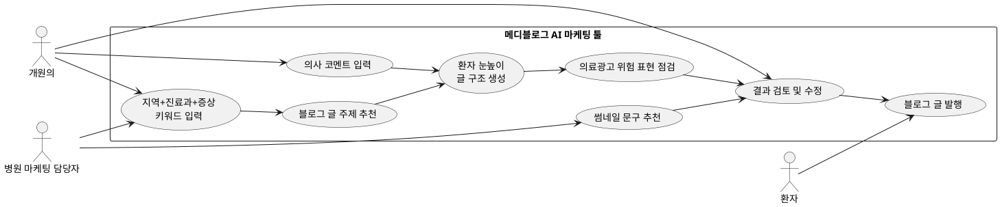

# 프로젝트 보고서용 정리 초안

## 1. 프로젝트 개요

### 1.1 문제 제목

개원의를 위한 네이버블로그 마케팅 자동화 및 의료광고 표현 점검 툴 설계

### 1.2 왜 문제로 인식하게 되었는가?

병원을 선택할 때 많은 환자는 네이버 검색과 블로그 글을 먼저 확인한다. 특히 감기, 피부질환, 통증, 예방접종, 건강검진처럼 생활 속에서 자주 겪는 건강 문제는 검색을 통해 병원 정보를 비교하는 경우가 많다. 이때 병원 블로그는 환자와 병원이 처음 만나는 중요한 접점이 된다.

그러나 실제로는 많은 개원의가 진료, 직원 관리, 예약 관리, 행정 업무를 동시에 수행해야 하므로 블로그 글을 꾸준히 직접 작성하기 어렵다. 그래서 일부 병원은 이미 만들어진 블로그를 구매하거나, 외부 마케팅 대행사에 글 작성을 맡긴다. 하지만 이런 방식은 의사가 직접 환자에게 설명하는 느낌이 약하고, 병원 고유의 진료 철학이나 신뢰를 충분히 담기 어렵다.

또한 의료 분야 블로그 글은 일반 상업 콘텐츠와 다르다. 치료 효과를 보장하거나, 부작용이 전혀 없다고 말하거나, 특정 시술을 과장하는 표현은 의료광고 규제와 신뢰도 문제로 이어질 수 있다. 따라서 개원의에게는 단순히 글을 많이 만들어주는 도구가 아니라, 의사가 직접 쓴 것처럼 신뢰도 높은 글을 효율적으로 발행하고, 의료광고상 위험한 표현을 점검할 수 있는 블로그 마케팅 보조 도구가 필요하다.

본 프로젝트는 이 문제를 해결하기 위해 개원의가 적은 시간으로 지역 환자의 검색 의도에 맞는 건강정보성 블로그 글을 직접 발행할 수 있도록 돕는 “메디블로그 AI 마케팅 툴”을 설계하는 것을 목표로 한다.

## 2. 문제해결과정 Work와 일정

### 2.1 역할 분담

| 담당자 | 역할 | 주요 산출물 |
|---|---|---|
| 본인 | 문제 제목, 문제 인식, 문제 발견, 문제정의, 바이브코딩 프롬프트 정리 | 프로젝트 개요, 정의 단계, 프롬프트 로그 |
| 보윤 | 일정 관리, 구현, 평가와 검증 | 간트차트, Python 구현물, 테스트 시나리오 |
| 연주 | 분석, 설계 | 요구사항기술서, Use Case Diagram |

### 2.2 간트차트

| 작업 | 5/13~5/16 | 5/17~5/20 | 5/21~5/24 | 5/25~5/28 | 5/29~6/3 |
|---|---|---|---|---|---|
| 주제 확정 및 문제 인식 정리 | ■■■ |  |  |  |  |
| 문제 발견 기법 적용 | ■■■ | ■ |  |  |  |
| 문제정의 작성 | ■■■ | ■ |  |  |  |
| 분석: 요구사항기술서 작성 |  | ■■■ | ■ |  |  |
| 설계: Use Case Diagram 작성 |  | ■ | ■■■ |  |  |
| 구현: Python 프로토타입 제작 |  |  | ■■■ | ■ |  |
| 평가: 테스트 시나리오 및 시뮬레이션 |  |  |  | ■■■ | ■ |
| 보고서 편집 및 최종 검토 |  |  |  | ■ | ■■■ |

## 3. 문제해결과정에 사용한 도구 또는 방법

| 단계 | 사용 도구 또는 방법 | 적용 내용 |
|---|---|---|
| 정의 | 체크리스트법, 결점 열거법, 희망점 열거법, 브레인스토밍 | 개원의 블로그 운영의 불편, 바라는 상태, 이해관계자, 제약사항 정리 |
| 분석 | 요구사항기술서 | 사용자 요구, 기능 요구사항, 비기능 요구사항, 제약사항 정리 |
| 설계 | Use Case Diagram, 로직트리, 화면 예시 | 개원의, 환자, 관리자 관점에서 핵심 기능과 상호작용 설계 |
| 구현 | Python 프로토타입, 바이브코딩 프롬프트 | 키워드 입력, 글 주제 추천, 의료광고 위험 표현 점검, 결과 출력 기능 구현 |
| 평가와 검증 | 테스트 시나리오, 가상 시뮬레이션 | 정상 입력, 위험 표현 포함 입력, 빈 입력, 여러 진료과 입력 등 테스트 |

## 4. 정의 단계: 문제 발견 기법 적용

### 4.1 체크리스트법

| 점검 항목 | 현재 상태 | 발견한 문제 |
|---|---|---|
| 누가 어려움을 겪는가? | 개원의, 병원 마케팅 담당자, 환자 | 개원의는 콘텐츠 제작이 어렵고, 환자는 신뢰할 정보를 찾기 어려움 |
| 언제 문제가 발생하는가? | 병원 홍보 글을 꾸준히 발행해야 할 때 | 진료 업무 때문에 글 작성이 뒤로 밀림 |
| 어디서 문제가 발생하는가? | 네이버블로그와 지역 검색 결과 | 검색 노출과 신뢰성 확보가 동시에 필요함 |
| 무엇이 부족한가? | 시간, 키워드 분석, 의료광고 표현 점검, 병원별 문체 반영 | 블로그 운영의 여러 작업이 분리되어 있음 |
| 왜 중요한가? | 블로그가 환자와 병원이 처음 만나는 접점이기 때문 | 글의 신뢰도가 병원 선택에 영향을 줄 수 있음 |

### 4.2 결점 열거법

| 결점 | 문제로 이어지는 이유 |
|---|---|
| 개원의가 직접 글을 쓰기에는 시간이 부족함 | 진료와 병원 운영을 병행해야 하므로 지속 발행이 어려움 |
| 블로그 구매나 대행사 의존이 많음 | 의사의 실제 설명 방식과 병원 고유의 철학이 약하게 드러남 |
| 광고성 문구가 많음 | 환자가 글을 신뢰하기 어려움 |
| 의료광고 위험 표현이 섞일 수 있음 | 과장 광고, 허위 광고, 규제 위반 위험이 발생함 |
| 글 작성, 키워드 분석, 썸네일 제작이 분리되어 있음 | 블로그 운영 비용과 시간이 커짐 |

### 4.3 희망점 열거법

| 바라는 점 | 기대 효과 |
|---|---|
| 의사가 직접 설명하는 느낌의 글이면 좋겠다 | 환자가 광고보다 신뢰할 수 있는 건강정보로 받아들임 |
| 환자 눈높이에 맞춘 쉬운 설명이면 좋겠다 | 전문용어로 인한 거리감이 줄어듦 |
| 지역 환자의 검색 키워드를 반영하면 좋겠다 | 실제 예약 문의와 연결될 가능성이 높아짐 |
| 의료광고 위험 표현을 자동으로 점검하면 좋겠다 | 규제 위험과 신뢰도 하락을 줄일 수 있음 |
| 글 초안, HTML, 썸네일이 한 번에 만들어지면 좋겠다 | 개원의가 적은 시간으로 꾸준히 발행할 수 있음 |

### 4.4 브레인스토밍

| 아이디어 | 설명 |
|---|---|
| 지역+진료과+증상 키워드 입력 | “강남 내과 감기”, “부산 피부과 여드름”처럼 실제 검색 의도 반영 |
| 의사 코멘트 입력 | 원장이 직접 넣은 짧은 설명을 글에 반영 |
| 의료광고 표현 점검 | “완치 보장”, “부작용 없음”, “최고” 등 위험 표현 탐지 |
| 환자 눈높이 글 초안 생성 | 질환 설명, 생활관리, 병원 방문 필요 신호, FAQ 구조 제공 |
| 썸네일 문구 추천 | 블로그 클릭률을 높이는 제목과 썸네일 문구 생성 |

## 5. 분석 단계: 요구사항기술서

### 5.1 사용자 요구

| 사용자 | 요구 |
|---|---|
| 개원의 | 직접 쓴 듯한 신뢰도 높은 블로그 글을 적은 시간으로 만들고 싶다 |
| 병원 마케팅 담당자 | 지역 키워드와 진료과별 콘텐츠를 체계적으로 관리하고 싶다 |
| 환자 | 광고성 글이 아니라 이해하기 쉽고 신뢰할 수 있는 건강정보를 얻고 싶다 |
| 의료광고 규제 관점 | 과장·허위 표현, 치료 보장 표현, 개인정보 노출을 줄여야 한다 |

### 5.2 기능 요구사항

| ID | 요구사항 | 설명 | 우선순위 |
|---|---|---|---|
| FR-01 | 키워드 입력 | 지역, 진료과, 증상 키워드를 입력받는다 | 상 |
| FR-02 | 블로그 글 주제 추천 | 입력 키워드를 바탕으로 글 제목과 주제를 추천한다 | 상 |
| FR-03 | 의사 코멘트 반영 | 원장이 입력한 진료 철학, 설명 문장, 주의사항을 글에 반영한다 | 상 |
| FR-04 | 의료광고 위험 표현 점검 | 과장·보장·비교우위 표현을 탐지한다 | 상 |
| FR-05 | 환자 눈높이 글 구조 생성 | 서론, 원인, 생활관리, 병원 방문 신호, FAQ 구조를 제안한다 | 중 |
| FR-06 | 썸네일 문구 추천 | 블로그 제목과 썸네일 문구를 추천한다 | 중 |
| FR-07 | 결과 저장 | 생성된 글 주제와 점검 결과를 저장한다 | 하 |

### 5.3 비기능 요구사항

| ID | 요구사항 | 설명 |
|---|---|---|
| NFR-01 | 신뢰성 | 의료광고 위험 표현을 놓치지 않도록 대표 위험 문구 목록을 유지한다 |
| NFR-02 | 사용성 | 비개발자인 개원의도 메뉴 기반으로 쉽게 사용할 수 있어야 한다 |
| NFR-03 | 설명 가능성 | 왜 위험 표현으로 판단했는지 이유를 함께 출력해야 한다 |
| NFR-04 | 안전성 | 진단, 치료, 처방을 대신하지 않는다는 안내를 포함해야 한다 |

## 6. 설계 단계: Use Case Diagram

### 6.1 액터

| 액터 | 설명 |
|---|---|
| 개원의 | 키워드를 입력하고, 의사 코멘트를 넣고, 글 초안과 위험 표현 점검 결과를 확인한다 |
| 병원 마케팅 담당자 | 콘텐츠 캘린더와 썸네일 문구를 관리한다 |
| 환자 | 최종 발행된 블로그 글을 읽고 병원 선택에 참고한다 |
| 시스템 | 키워드 분석, 글 구조 추천, 위험 표현 점검, 결과 출력을 수행한다 |

### 6.2 Use Case 목록

| Use Case | 액터 | 설명 |
|---|---|---|
| 키워드 입력 | 개원의, 마케팅 담당자 | 지역+진료과+증상 키워드를 입력한다 |
| 글 주제 추천 | 시스템 | 입력 키워드를 바탕으로 블로그 글 제목과 주제를 제안한다 |
| 의사 코멘트 입력 | 개원의 | 원장의 설명 방식, 주의사항, 진료 철학을 입력한다 |
| 의료광고 표현 점검 | 시스템 | 위험 표현을 찾아 이유와 수정 방향을 제시한다 |
| 글 구조 생성 | 시스템 | 환자 눈높이에 맞는 블로그 글 구조를 만든다 |
| 썸네일 문구 추천 | 시스템 | 클릭률과 신뢰감을 고려한 썸네일 문구를 제안한다 |
| 결과 검토 | 개원의 | 최종 글 초안과 위험 표현 점검 결과를 확인한다 |

### 6.3 Use Case Diagram 코드

아래 코드는 보고서나 발표자료에서 Use Case Diagram으로 변환할 수 있는 PlantUML 형식이다.



## 7. 구현 단계: Python 프로토타입

### 7.1 구현 목표

Python 프로토타입은 실제 네이버 API나 AI 모델을 연결하는 완성형 서비스가 아니라, 설계한 핵심 로직이 어떻게 동작하는지 보여주는 교육용 구현물이다. 핵심 구현 목표는 다음과 같다.

1. 지역, 진료과, 증상 키워드를 입력받는다.
2. 입력값을 바탕으로 블로그 글 제목을 추천한다.
3. 의사 코멘트를 입력받아 글 구조에 반영한다.
4. 위험 표현 목록과 비교하여 의료광고 위험 표현을 탐지한다.
5. 위험 표현이 있으면 수정 방향을 출력한다.
6. 최종적으로 글 주제, 글 구조, 위험 표현 점검 결과를 표 형태로 출력한다.

### 7.2 바이브코딩 프롬프트 로그

아래는 Python 구현물을 만들 때 사용한 프롬프트 예시이다. 단순히 “코드 짜줘”가 아니라, 요구사항, 제약조건, 입출력, 검증 기준을 단계별로 제시하여 구현 품질을 높이는 방식으로 작성하였다.

#### Prompt 1. 프로젝트 맥락 정의

```text
너는 Python으로 교육용 콘솔 프로그램을 설계하는 시니어 개발자다.

프로젝트 주제는 “개원의를 위한 네이버블로그 마케팅 자동화 및 의료광고 표현 점검 툴”이다.
이 프로그램은 실제 의료 진단이나 처방을 수행하지 않고, 개원의가 블로그 글을 작성할 때 다음을 보조하는 프로토타입이다.

목표:
1. 지역, 진료과, 증상 키워드를 입력받는다.
2. 환자 눈높이에 맞는 블로그 글 제목과 글 구조를 추천한다.
3. 의사가 직접 입력한 짧은 코멘트를 글 구조에 반영한다.
4. 의료광고상 위험할 수 있는 표현을 탐지한다.
5. 위험 표현이 있으면 이유와 수정 방향을 출력한다.

제약:
- Python 표준 라이브러리만 사용한다.
- 외부 API, 파일 DB, 네트워크 기능은 사용하지 않는다.
- 콘솔 메뉴 기반으로 구현한다.
- 코드에는 함수 분리를 적용한다.
- 사용자가 잘못 입력해도 프로그램이 바로 종료되지 않도록 기본 예외 처리를 한다.

산출물:
- 전체 Python 소스코드
- 주요 함수 설명
- 테스트 입력 예시 3개
```

#### Prompt 2. 요구사항을 함수 구조로 변환

```text
위 프로젝트를 Python 함수 설계로 먼저 나누어줘.

반드시 포함할 함수:
1. print_menu(): 메뉴 출력
2. get_user_input(): 지역, 진료과, 증상, 의사 코멘트 입력
3. recommend_title(): 입력 키워드를 바탕으로 블로그 제목 추천
4. generate_outline(): 환자 눈높이 글 구조 생성
5. check_ad_risk_expression(): 위험 표현 탐지
6. print_risk_report(): 위험 표현 점검 결과 출력
7. print_final_preview(): 최종 블로그 글 기획안 출력

각 함수마다:
- 역할
- 입력값
- 출력값
- 내부 처리 로직
을 표로 설명해줘.

아직 코드는 작성하지 말고 설계만 해줘.
```

#### Prompt 3. 데이터 구조 설계

```text
Python에서 사용할 데이터 클래스를 설계해줘.

필요한 데이터:
- 지역명
- 진료과
- 증상 키워드
- 의사 코멘트
- 추천 제목
- 글 구조
- 위험 표현 발견 여부
- 발견된 위험 표현 목록
- 수정 제안

조건:
- 문자열은 str 타입으로 처리한다.
- 최대 길이를 명확히 정의한다.
- 위험 표현 목록은 배열로 관리한다.
- 데이터 클래스 이름은 BlogRequest, RiskResult로 한다.

출력:
1. 상수 목록
2. dataclass 정의
3. 각 필드 설명
```

#### Prompt 4. 의료광고 위험 표현 점검 로직 작성

```text
의료광고 위험 표현 점검 함수를 Python으로 작성해줘.

탐지할 위험 표현 예시:
- 완치 보장
- 부작용 없음
- 100% 효과
- 최고
- 유일
- 무조건
- 즉시 효과
- 통증 없음

함수 요구사항:
- 함수명: check_ad_risk_expression
- 입력: 사용자가 작성한 문장 또는 의사 코멘트
- 출력: RiskResult 데이터 클래스
- in 연산자와 정규표현식을 활용하여 위험 표현 포함 여부를 확인한다.
- 위험 표현이 발견되면 왜 위험한지 간단한 이유를 함께 저장한다.
- 위험 표현이 없으면 “위험 표현 없음”을 출력할 수 있도록 한다.

주의:
- 이 프로그램은 법률 자문이 아니라 교육용 점검 도구임을 주석에 명시한다.
```

#### Prompt 5. 블로그 글 구조 추천 로직 작성

```text
지역, 진료과, 증상 키워드를 입력받아 블로그 글 구조를 추천하는 Python 함수를 작성해줘.

예시 입력:
- 지역: 강남
- 진료과: 내과
- 증상: 감기
- 의사 코멘트: 고열이 오래가거나 호흡곤란이 있으면 진료가 필요합니다.

예시 출력:
제목: 강남 내과에서 알려주는 감기 증상과 병원 방문이 필요한 경우
글 구조:
1. 감기 증상으로 병원을 찾는 이유
2. 감기에서 흔한 증상
3. 집에서 할 수 있는 생활관리
4. 병원 방문이 필요한 위험 신호
5. 의사 코멘트
6. 자주 묻는 질문

조건:
- 과장된 치료 효과 표현은 사용하지 않는다.
- 환자에게 불안을 주는 표현보다 안내 중심으로 작성한다.
- 진단이나 처방을 단정하지 않는다.
```

#### Prompt 6. 전체 Python 프로그램 통합

```text
지금까지 설계한 데이터 클래스와 함수를 하나의 Python 콘솔 프로그램으로 통합해줘.

프로그램 흐름:
1. 시작 안내문 출력
2. 사용자에게 지역, 진료과, 증상 키워드, 의사 코멘트 입력받기
3. 추천 블로그 제목 생성
4. 환자 눈높이 글 구조 생성
5. 의사 코멘트에서 위험 표현 점검
6. 최종 결과 출력
7. 다시 실행 여부 확인

코드 스타일:
- 함수 단위로 분리
- 변수명은 의미 있게 작성
- 한국어 주석 추가
- main 함수는 전체 흐름만 읽히게 작성
- python3로 실행 가능한 코드 작성

마지막에 실행 명령어와 실행 예시도 같이 작성해줘.
```

#### Prompt 7. 테스트 시나리오 생성

```text
위 Python 프로그램을 평가하기 위한 테스트 시나리오를 만들어줘.

테스트는 최소 5개:
1. 정상 입력
2. 위험 표현 포함 입력
3. 빈 문자열 입력
4. 긴 문장 입력
5. 여러 진료과에서 사용할 수 있는 일반성 테스트

각 테스트마다:
- 입력값
- 기대 출력
- 검증 기준
- 통과/실패 판단 기준
을 표로 작성해줘.
```

#### Prompt 8. 코드 리뷰 및 개선 요청

```text
아래 Python 코드를 코드 리뷰해줘.

리뷰 기준:
1. 함수 분리가 적절한가?
2. 입력값 검증과 문자열 처리 방식이 안전한가?
3. 위험 표현 탐지 로직이 너무 단순하지 않은가?
4. 사용자가 잘못 입력했을 때 안내가 충분한가?
5. 보고서에 설명하기 쉬운 구조인가?

리뷰 결과는:
- 문제점
- 개선 이유
- 수정 코드
- 테스트 방법
순서로 작성해줘.
```

## 8. 평가와 검증

### 8.1 테스트 시나리오

| 테스트 ID | 입력 | 기대 결과 | 검증 기준 |
|---|---|---|---|
| TC-01 정상 입력 | 지역: 강남, 진료과: 내과, 증상: 감기 | 감기 관련 블로그 제목과 글 구조 추천 | 제목에 지역·진료과·증상이 포함되는가 |
| TC-02 위험 표현 포함 | “감기 100% 완치 보장” | 위험 표현으로 탐지 | “100%”, “완치 보장”을 탐지하는가 |
| TC-03 대행사식 과장 문구 | “최고의 병원, 부작용 없음” | 과장 표현 경고 | “최고”, “부작용 없음”을 탐지하는가 |
| TC-04 빈 입력 | 증상 키워드 미입력 | 재입력 안내 | 프로그램이 비정상 종료되지 않는가 |
| TC-05 의사 코멘트 반영 | “고열이 오래가면 진료 필요” | 글 구조에 의사 코멘트 포함 | 코멘트가 최종 출력에 반영되는가 |

### 8.2 평가 기준

| 평가 항목 | 기준 |
|---|---|
| 기능성 | 키워드 입력, 제목 추천, 위험 표현 점검, 결과 출력이 동작하는가 |
| 신뢰성 | 위험 표현을 누락하지 않고 경고하는가 |
| 사용성 | 비개발자도 콘솔 흐름을 이해할 수 있는가 |
| 안전성 | 진단·치료·처방을 대신하지 않는다는 안내가 포함되는가 |
| 보고서 적합성 | 문제정의, 분석, 설계, 구현, 평가 단계와 연결되는가 |

