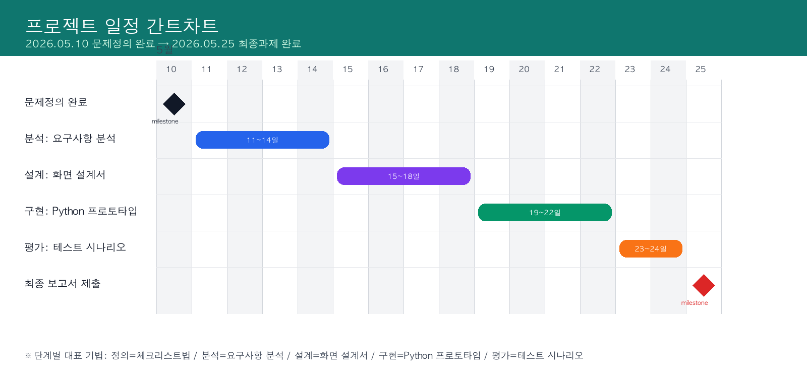
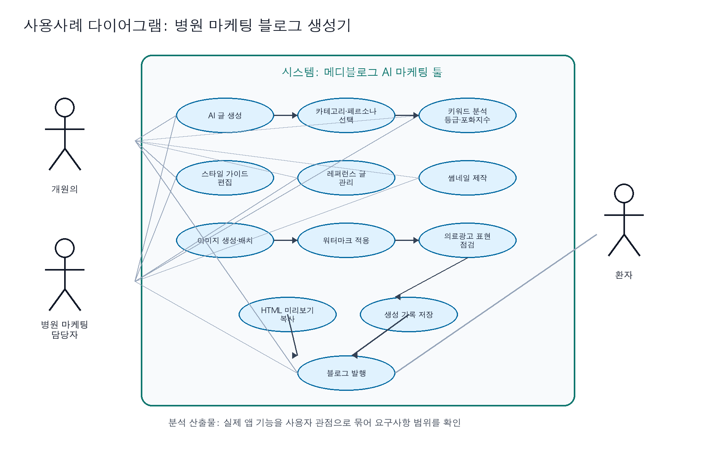
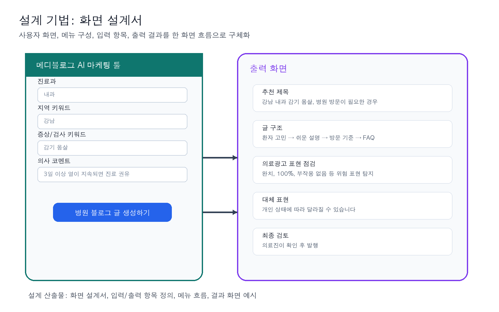

# 프로젝트개요·방법론 수정본

## 1. 문제 정의

### 1.1 문제 제목
개원의를 위한 병원 마케팅 블로그 생성기: 신뢰도 높은 의료진 직접 작성형 콘텐츠와 의료광고 표현 점검 도구

### 1.2 왜 문제로 인식했는가
환자는 병원을 선택하기 전에 검색을 통해 증상, 진료과, 병원 정보를 확인한다. 그러나 많은 개원의는 진료와 병원 운영을 병행하므로 블로그 글을 지속적으로 직접 작성하기 어렵고, 외부 대행 글은 의료진의 실제 설명 방식과 병원 고유의 신뢰가 약하게 드러날 수 있다. 또한 병원 블로그는 일반 홍보 글과 달리 의료법상 거짓·과장 의료광고 위험을 함께 고려해야 한다. 따라서 개원의가 직접 검토한 듯한 정보형 글을 빠르게 만들고, 위험 표현을 점검할 수 있는 병원 마케팅 블로그 생성기가 필요하다고 판단했다.

### 1.3 문제 발견에 사용한 데이터
| 근거 데이터 | 내용 | 본 프로젝트와의 연결 | 출처 |
|---|---|---|---|
| 국내 인터넷 이용률 | 2024년 만 3세 이상 인터넷 이용률은 94.5% | 병원 정보 탐색도 온라인 중심으로 이루어질 가능성이 큼 | 과학기술정보통신부·NIA, 2024 인터넷이용실태조사 |
| 건강·의료정보 검색 이용률 | 인터넷 이용자의 59.3%가 건강·의료정보 검색을 위해 인터넷 이용 | 환자가 증상과 병원을 검색한다는 직접 근거 | 질병관리청 국가건강정보포털 |
| 인터넷 기반 의료정보와 병원 선택 | 조사 응답자의 약 90%가 인터넷 기반 의료정보서비스 접근 경험, 66.3%는 질병 치료법·건강증진·일반 건강지식 습득 목적, 일부는 이용한 정보를 제공한 병원을 방문 | 병원 블로그 콘텐츠가 병원 선택 및 의료서비스 마케팅과 연결될 수 있음 | 정희태·김정아, KCI 논문 |
| 의료광고 법적 제약 | 의료법 제56조는 거짓·과장 의료광고를 금지 | 생성형 글에는 광고 표현 점검 기능이 필요 | 국가법령정보센터, 의료법 제56조 |
| 온라인 평판의 영향 | 온라인 의사 평가/리뷰 사이트가 환자의 의사 선택에 영향을 줄 수 있음 | 블로그와 검색 노출은 병원 신뢰 형성의 일부 | BMC Health Services Research |

### 1.4 문제 발견 기법: 체크리스트법

이 단계에서 사용한 기법은 **체크리스트법 하나**이다. 체크리스트법을 선택한 이유는 문제 발견 단계에서 감으로 아이디어를 내기보다, 누가/언제/어디서/무엇이/왜 불편한지 빠짐없이 확인할 수 있기 때문이다. 특히 병원 블로그 문제는 사용자, 법적 제약, 콘텐츠 신뢰도, 검색 노출이 함께 얽혀 있어 항목별 점검이 적합하다.

| 체크 항목 | 확인 내용 | 발견한 문제 |
|---|---|---|
| 누가 어려움을 겪는가 | 개원의, 병원 마케팅 담당자, 환자 | 개원의는 글 작성 시간이 부족하고 환자는 신뢰 가능한 정보를 찾기 어렵다 |
| 언제 문제가 발생하는가 | 병원 블로그를 꾸준히 발행해야 할 때 | 진료·행정 업무 때문에 콘텐츠 발행이 중단되기 쉽다 |
| 어디서 문제가 발생하는가 | 네이버 검색, 병원 블로그, 지역 키워드 검색 결과 | 정보성 콘텐츠와 광고성 콘텐츠가 섞여 신뢰 판단이 어렵다 |
| 무엇이 부족한가 | 시간, 글 구조, 의료광고 표현 점검, 병원별 문체 | 대행 글은 의사가 직접 설명하는 느낌이 부족할 수 있다 |
| 왜 중요한가 | 병원 블로그가 환자와 병원이 처음 만나는 접점이 될 수 있음 | 글의 신뢰도와 표현 안전성이 병원 선택에 영향을 줄 수 있다 |

### 1.5 문제 정의문
개원의는 환자에게 신뢰를 주는 블로그 글을 직접 발행하고 싶지만, 시간 부족과 의료광고 표현 위험 때문에 지속적인 콘텐츠 운영이 어렵다. 따라서 지역·진료과·증상 키워드를 입력하면 환자 눈높이의 글 구조와 초안을 만들고, 과장·보장 표현을 점검해주는 Python 기반 병원 마케팅 블로그 생성기를 설계한다.

## 2. 문제해결과정 Work와 일정



| 단계 | 대표 기법 | 담당 | 기간 | 산출물 |
|---|---|---|---|---|
| 문제정의 | 체크리스트법 | 본인 | 5/10 완료 | 문제정의문, 근거 데이터 표 |
| 분석 | 요구사항 분석 | 연주 | 5/11~5/14 | 요구사항 명세서, 사용사례 다이어그램 |
| 설계 | 화면 설계서 | 연주 | 5/15~5/18 | 화면 설계서, 입력/출력 화면 예시 |
| 구현 | Python 프로토타입 | 보윤 | 5/19~5/22 | 콘솔 프로토타입, 프롬프트 로그 |
| 평가와 검증 | 테스트 시나리오 | 보윤 | 5/23~5/24 | 테스트 결과표, 개선점 |
| 최종 정리 | 최종 편집 | 팀 | 5/25 | 최종 보고서 |

## 3. 분석: 요구사항 분석

### 3.1 분석 기법 선정
이 단계에서 사용한 기법은 **요구사항 분석** 하나이다. 요구사항 분석은 외부 사용자가 시스템에 무엇을 입력하고, 시스템이 어떤 출력을 제공해야 하는지 정리하는 방법이다. 내부 알고리즘을 먼저 정하기보다 사용자 요구, 기능 요구, 제약조건을 명확히 하기에 적합하다.

### 3.2 요구사항 분석 과정
1. 자료 수집: 건강·의료정보 검색 이용률, 병원 선택 관련 연구, 의료광고 규제 자료 확인
2. 외부 입력 정의: 지역, 진료과, 증상 키워드, 의사 코멘트, 점검할 문장
3. 시스템 출력 정의: 제목 추천, 글 구조, 의료광고 위험 표현, 대체 표현, 최종 초안
4. 기능 결정: 내부 구현 방식보다 사용자가 체감하는 기능 중심으로 정리

### 3.3 요구사항 명세서
| ID | 구분 | 요구사항 | 상세 설명 | 우선순위 |
|---|---|---|---|---|
| FR-01 | 기능 | 키워드 입력 | 지역, 진료과, 증상 키워드를 입력받는다 | 상 |
| FR-02 | 기능 | 블로그 제목 추천 | 입력 키워드를 조합하여 검색 친화적인 제목을 추천한다 | 상 |
| FR-03 | 기능 | 글 구조 생성 | 환자 고민, 쉬운 설명, 방문 기준, FAQ 구조를 생성한다 | 상 |
| FR-04 | 기능 | 의사 코멘트 반영 | 원장이 입력한 설명과 주의사항을 글 구조에 반영한다 | 상 |
| FR-05 | 기능 | 의료광고 표현 점검 | 완치, 100%, 부작용 없음, 최고 등 위험 표현을 탐지한다 | 상 |
| FR-06 | 기능 | 대체 표현 제안 | 위험 표현의 이유와 수정 방향을 함께 출력한다 | 중 |
| NFR-01 | 비기능 | 신뢰성 | 진단·처방을 대신하지 않는 안전 문구를 포함한다 | 상 |
| NFR-02 | 비기능 | 사용성 | 비개발자인 개원의도 입력 항목을 쉽게 이해할 수 있어야 한다 | 상 |
| NFR-03 | 제약 | 법적 안전성 | 의료법상 거짓·과장 광고로 보일 수 있는 표현을 피한다 | 상 |
| NFR-04 | 제약 | 구현 범위 | 1차 구현은 Python 표준 라이브러리 중심의 프로토타입으로 제한한다 | 중 |

### 3.4 사용사례 다이어그램


## 4. 설계: 화면 설계서

### 4.1 설계 기법 선정
이 단계에서 사용한 기법은 **화면 설계서** 하나이다. 화면 설계서는 시스템을 사용하는 사용자 정의, 메뉴 구성, 입력 항목, 출력 화면 예시를 구체적으로 정리하는 문서이다. PPT 자료에서 설명한 것처럼 설계 단계에서는 구현 전에 사용자가 보게 될 화면과 흐름을 먼저 구체화해야 하므로, 본 프로젝트에서는 화면 설계서를 대표 기법으로 사용한다.



### 4.2 화면 설계서 구성
| 구성 요소 | 설계 내용 |
|---|---|
| 사용자 정의 | 개원의, 병원 마케팅 담당자, 의료진 검수자 |
| 메뉴 구성 | 키워드 입력, 글 생성, 표현 점검, 결과 확인 |
| 입력 항목 | 지역, 진료과, 증상/검사 키워드, 의사 코멘트, 점검할 문장 |
| 출력 항목 | 추천 제목, 글 구조, 의료광고 위험 표현, 대체 표현, 안전 문구 |
| 화면 흐름 | 입력 화면 → 생성 버튼 → 결과 화면 → 의료진 검토 → 발행 |

### 4.3 기능별 화면 설계
1. 키워드 입력 화면: 지역·진료과·증상 입력값을 받는다.
2. 글 생성 화면: 입력값을 바탕으로 제목과 글 구조를 생성한다.
3. 표현 점검 화면: 완치, 100%, 부작용 없음 등 위험 표현을 탐지한다.
4. 결과 확인 화면: 최종 초안, FAQ, 안전 문구, 대체 표현을 보여준다.
5. 의료진 검토 화면: 발행 전 원장이 수정할 수 있도록 결과를 정리한다.

## 5. 구현: Python 프로토타입

### 5.1 구현 기법 선정
이 단계에서 사용한 기법은 **Python 프로토타입 구현** 하나이다. 실제 서비스 전체를 완성하기보다 핵심 기능이 동작하는지 보여주는 교육용 구현으로 범위를 제한했다.

### 5.2 구현 기능
- `BlogRequest`: 지역, 진료과, 증상, 의사 코멘트를 저장
- `recommend_title()`: 블로그 제목 추천
- `generate_outline()`: 글 구조 생성
- `check_ad_risk_expression()`: 위험 표현 탐지
- `print_risk_report()`: 위험 표현 이유와 대체 방향 출력

### 5.3 바이브코딩 프롬프트 예시
```text
너는 Python으로 교육용 콘솔 프로그램을 설계하는 시니어 개발자다.
프로젝트 주제는 “개원의를 위한 병원 마케팅 블로그 생성기”이다.
표준 라이브러리만 사용하고, 지역·진료과·증상·의사 코멘트를 입력받아
블로그 제목, 글 구조, 의료광고 위험 표현 점검 결과를 출력하는 프로토타입을 작성해줘.
위험 표현은 완치, 100%, 부작용 없음, 최고, 유일, 무조건을 포함하고,
각 표현마다 위험 이유와 대체 표현을 함께 출력해줘.
```

## 6. 평가와 검증: 테스트 시나리오

### 6.1 평가 기법 선정
이 단계에서 사용한 기법은 **테스트 시나리오** 하나이다. 입력값을 바꾸어 시스템 출력이 목표와 맞는지 확인하기에 적합하다.

| 테스트 ID | 입력 조건 | 기대 결과 | 판정 기준 |
|---|---|---|---|
| TC-01 | 강남/내과/감기 몸살 입력 | 지역·진료과·증상이 포함된 제목 출력 | 제목에 핵심 키워드 포함 |
| TC-02 | “완치 보장” 포함 문장 입력 | 위험 표현 탐지 | 위험 이유와 대체 표현 출력 |
| TC-03 | 의사 코멘트 입력 | 글 구조에 코멘트 반영 | 의료진 코멘트 항목 생성 |
| TC-04 | 빈 의사 코멘트 입력 | 기본 안전 안내 출력 | 프로그램 오류 없이 실행 |
| TC-05 | “최고, 100% 효과” 입력 | 복수 위험 표현 탐지 | 두 표현 모두 탐지 |

## 7. 출처
1. 과학기술정보통신부·한국지능정보사회진흥원, 2024 인터넷이용실태조사(e-나라지표): https://www.index.go.kr/unity/potal/main/EachDtlPageDetail.do?idx_cd=1346
2. 질병관리청 국가건강정보포털 사업 개요: https://www.kdca.go.kr/kdca/3365/subview.do
3. 정희태·김정아, 의료소비자의 인터넷 기반 의료정보서비스 이용행태와 병원선택, Healthcare Informatics Research, KCI: https://www.kci.go.kr/kciportal/ci/sereArticleSearch/ciSereArtiView.kci?sereArticleSearchBean.artiId=ART001154769
4. 의료법 제56조 의료광고의 금지 등, 국가법령정보센터: https://law.go.kr/LSW/lsSideInfoP.do?docCls=jo&joBrNo=00&joNo=0056&lsiSeq=279731&urlMode=lsScJoRltInfoR
5. BMC Health Services Research, Popularity of internet physician rating sites and their apparent influence on patients’ choices of physicians: https://bmchealthservres.biomedcentral.com/articles/10.1186/s12913-015-1099-2
