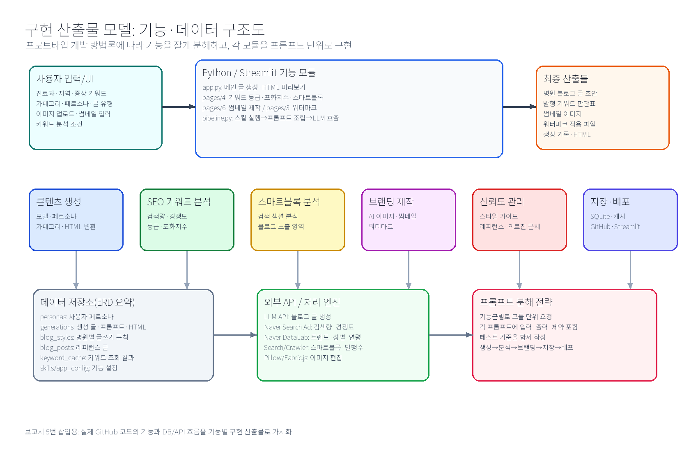

# 프로젝트개요·방법론 수정본

## 1. 문제 정의

### 1.1 문제 제목
개원의를 위한 병원 마케팅 블로그 생성기: 신뢰도 높은 의료진 직접 작성형 콘텐츠와 의료광고 표현 점검 도구

### 1.2 왜 문제로 인식했는가
환자는 병원을 선택하기 전에 검색을 통해 증상, 진료과, 병원 정보를 확인한다. 그러나 많은 개원의는 진료와 병원 운영을 병행하므로 블로그 글을 지속적으로 직접 작성하기 어렵고, 외부 대행 글은 의료진의 실제 설명 방식과 병원 고유의 신뢰가 약하게 드러날 수 있다. 또한 병원 블로그는 일반 홍보 글과 달리 의료법상 거짓·과장 의료광고 위험을 함께 고려해야 한다. 따라서 개원의가 직접 검토한 듯한 정보형 글을 빠르게 만들고, 위험 표현을 점검할 수 있는 병원 마케팅 블로그 생성기가 필요하다고 판단했다.

### 1.3 문제 발견에 사용한 데이터
| 근거 데이터 | 내용 | 본 프로젝트와의 연결 | 출처 |
|---|---|---|---|
| 국내 인터넷 이용률 | 2024년 만 3세 이상 인터넷 이용률은 94.5% | 병원 정보 탐색도 온라인 중심으로 이루어질 가능성이 큼 | 과학기술정보통신부·NIA, 2024 인터넷이용실태조사 |
| 건강·의료정보 검색 이용률 | 인터넷 이용자의 59.3%가 건강·의료정보 검색을 위해 인터넷 이용 | 환자가 증상과 병원을 검색한다는 직접 근거 | 질병관리청 국가건강정보포털 |
| 인터넷 기반 의료정보와 병원 선택 | 조사 응답자의 약 90%가 인터넷 기반 의료정보서비스 접근 경험, 66.3%는 질병 치료법·건강증진·일반 건강지식 습득 목적, 일부는 이용한 정보를 제공한 병원을 방문 | 병원 블로그 콘텐츠가 병원 선택 및 의료서비스 마케팅과 연결될 수 있음 | 정희태·김정아, KCI 논문 |
| 의료광고 법적 제약 | 의료법 제56조는 거짓·과장 의료광고를 금지 | 생성형 글에는 광고 표현 점검 기능이 필요 | 국가법령정보센터, 의료법 제56조 |
| 온라인 평판의 영향 | 온라인 의사 평가/리뷰 사이트가 환자의 의사 선택에 영향을 줄 수 있음 | 블로그와 검색 노출은 병원 신뢰 형성의 일부 | BMC Health Services Research |

### 1.4 문제 발견 기법: 체크리스트법
이 단계에서 사용한 기법은 **체크리스트법 하나**이다. 체크리스트법을 선택한 이유는 문제 발견 단계에서 감으로 아이디어를 내기보다, 누가/언제/어디서/무엇이/왜 불편한지 빠짐없이 확인할 수 있기 때문이다. 특히 병원 블로그 문제는 사용자, 법적 제약, 콘텐츠 신뢰도, 검색 노출이 함께 얽혀 있어 항목별 점검이 적합하다.

| 체크 항목 | 확인 내용 | 발견한 문제 |
|---|---|---|
| 누가 어려움을 겪는가 | 개원의, 병원 마케팅 담당자, 환자 | 개원의는 글 작성 시간이 부족하고 환자는 신뢰 가능한 정보를 찾기 어렵다 |
| 언제 문제가 발생하는가 | 병원 블로그를 꾸준히 발행해야 할 때 | 진료·행정 업무 때문에 콘텐츠 발행이 중단되기 쉽다 |
| 어디서 문제가 발생하는가 | 네이버 검색, 병원 블로그, 지역 키워드 검색 결과 | 정보성 콘텐츠와 광고성 콘텐츠가 섞여 신뢰 판단이 어렵다 |
| 무엇이 부족한가 | 시간, 글 구조, 의료광고 표현 점검, 병원별 문체 | 대행 글은 의사가 직접 설명하는 느낌이 부족할 수 있다 |
| 왜 중요한가 | 병원 블로그가 환자와 병원이 처음 만나는 접점이 될 수 있음 | 글의 신뢰도와 표현 안전성이 병원 선택에 영향을 줄 수 있다 |

### 1.5 문제 정의문
개원의는 환자에게 신뢰를 주는 블로그 글을 직접 발행하고 싶지만, 시간 부족과 의료광고 표현 위험 때문에 지속적인 콘텐츠 운영이 어렵다. 따라서 지역·진료과·증상 키워드를 입력하면 환자 눈높이의 글 구조와 초안을 만들고, 키워드 경쟁도·등급·포화지수를 참고해 발행 전략을 세우며, 썸네일·워터마크까지 제작할 수 있는 Python 기반 병원 마케팅 블로그 생성기를 설계한다.

## 2. 문제해결과정 Work와 일정

| 단계 | 대표 기법 | 담당 | 기간 | 산출물 |
|---|---|---|---|---|
| 문제정의 | 체크리스트법 | 본인 | 5/10 완료 | 문제정의문, 근거 데이터 표 |
| 분석 | 요구사항 분석 | 연주 | 5/11~5/14 | 요구사항 기술서, 요구사항 명세서, 사용사례 다이어그램 |
| 설계 | 화면 설계서 | 연주 | 5/15~5/18 | 메인 화면, 분석 화면, 썸네일/워터마크 화면 설계 |
| 구현 | 프로토타입 개발 방법론 | 보윤 | 5/19~5/22 | Python/Streamlit 구현, 모듈 통합, 배포 |
| 평가와 검증 | 테스트 시나리오 | 보윤 | 5/23~5/24 | 테스트 결과표, 개선점 |
| 최종 정리 | 최종 편집 | 팀 | 5/25 | 최종 보고서 |

## 3. 분석: 요구사항 분석

### 3.1 분석 기법 선정
이 단계에서 사용한 기법은 **요구사항 분석** 하나이다. 요구사항 분석은 사용자가 원하는 서비스와 시스템이 제공해야 할 기능을 정리하는 방법이다. 본 프로젝트는 단순 글 생성기가 아니라 키워드 분석, 콘텐츠 생성, 이미지·썸네일 제작, 워터마크, 레퍼런스 관리, 배포까지 포함한 블로그 운영 도구이므로 요구사항을 기능군별로 나누어 정의했다.

### 3.2 요구사항 기술서
| 항목 | 내용 |
|---|---|
| 시스템명 | 메디블로그 AI 마케팅 툴 |
| 목적 | 개원의가 병원 블로그 글을 직접 기획·생성·검토·발행할 수 있도록 지원 |
| 주요 사용자 | 개원의, 병원 마케팅 담당자, 의료진 검수자 |
| 핵심 입력 | 진료과, 지역 키워드, 증상/검사 키워드, 의사 코멘트, 이미지, 레퍼런스 글 |
| 핵심 출력 | 블로그 초안, HTML, 키워드 등급, 포화지수, 스마트블록 분석, 썸네일, 워터마크 파일 |
| 운영 환경 | Python, Streamlit, LiteLLM, Naver API, SQLite/Supabase, GitHub, Streamlit Cloud |
| 주요 제약 | 의료광고 과장 표현 방지, API 키 보안, 의료진 최종 검토 필요 |

### 3.3 요구사항 명세서
| ID | 기능군 | 요구사항 | 상세 설명 | 우선순위 |
|---|---|---|---|---|
| FR-01 | 콘텐츠 생성 | AI 모델 선택 | Claude/GPT/Gemini 등 모델을 선택해 병원 블로그 초안을 생성한다 | 상 |
| FR-02 | 콘텐츠 생성 | 카테고리 프리셋 | 지역 진료 키워드, 증상 설명, 검사·시술 안내 등 카테고리별 기본 설정을 제공한다 | 상 |
| FR-03 | 콘텐츠 생성 | 페르소나 선택 | 개원의, 환자 눈높이, 보호자, 의료광고 점검 페르소나를 제공한다 | 상 |
| FR-04 | 콘텐츠 생성 | 글 유형 선택 | 일반 정보형, 리스트형, 병원 이용 안내형 등 글 유형을 선택한다 | 중 |
| FR-05 | 콘텐츠 생성 | 본문 생성 및 HTML 변환 | Markdown 초안을 생성하고 네이버블로그 붙여넣기용 HTML로 변환한다 | 상 |
| FR-06 | 콘텐츠 생성 | 이미지 배치 마커 | 업로드 이미지 또는 AI 생성 이미지를 본문 위치에 마커로 표시한다 | 중 |
| FR-07 | 신뢰도 관리 | 병원 스타일 가이드 적용 | 공통 스타일과 카테고리별 글쓰기 규칙을 생성 프롬프트에 반영한다 | 상 |
| FR-08 | 신뢰도 관리 | 스타일 편집 | 공통 스타일, 카테고리별 스타일, 새 카테고리를 웹에서 편집한다 | 중 |
| FR-09 | 신뢰도 관리 | 레퍼런스 글 관리 | 의료진이 검토한 글을 추가·수정·삭제하고 새 글 생성에 참고한다 | 상 |
| FR-10 | SEO 분석 | 키워드 검색량 분석 | 네이버 검색광고 API 기반 월간 PC/모바일 검색량과 경쟁도를 조회한다 | 상 |
| FR-11 | SEO 분석 | 키워드 등급 산출 | 검색량, 경쟁도, 포화도를 합산해 S/A/B/C/D 등급을 산출한다 | 상 |
| FR-12 | SEO 분석 | 콘텐츠 포화지수 | 블로그/카페/전체 발행수 대비 검색량으로 포화지수를 계산한다 | 상 |
| FR-13 | SEO 분석 | 트렌드 분석 | DataLab 기반 기간, 기기, 성별, 연령대별 검색 트렌드를 확인한다 | 중 |
| FR-14 | SEO 분석 | 연관 키워드·클러스터 | 연관 키워드, 주제 클러스터, 해시태그, 워드 클라우드를 제공한다 | 중 |
| FR-15 | SEO 분석 | 스마트블록 분석 | 네이버 검색 결과의 스마트블록 구성과 블로그 노출 위치를 확인한다 | 중 |
| FR-16 | 이미지/브랜딩 | AI 이미지 생성 | 블로그 주제에 맞는 대표 이미지와 본문 이미지를 생성한다 | 중 |
| FR-17 | 이미지/브랜딩 | 썸네일 제작 | 템플릿, 텍스트, 색상, 배경 이미지, 정렬 기능으로 썸네일을 제작한다 | 상 |
| FR-18 | 이미지/브랜딩 | 워터마크 적용 | 이미지/PDF에 병원 건강정보 워터마크를 위치·투명도·색상 옵션으로 삽입한다 | 중 |
| FR-19 | 데이터 관리 | 생성 기록 저장 | 생성된 글의 주제, 결과, HTML, 설정값을 기록으로 보관한다 | 중 |
| FR-20 | 데이터 관리 | 캐시와 DB 연동 | 키워드 분석 결과와 설정 데이터를 SQLite/Supabase에 저장하고 재사용한다 | 중 |
| FR-21 | 배포/운영 | Streamlit 배포 | GitHub push 후 Streamlit Cloud에서 앱을 실행할 수 있도록 구성한다 | 상 |
| FR-22 | 안전성 | 의료광고 표현 안전장치 | 완치 보장, 100%, 부작용 없음 등 위험 표현을 피하도록 프롬프트와 점검 구조를 둔다 | 상 |

### 3.4 비기능 요구사항
| ID | 구분 | 요구사항 |
|---|---|---|
| NFR-01 | 사용성 | 비개발자인 개원의도 입력-생성-검토 흐름을 따라 사용할 수 있어야 한다 |
| NFR-02 | 신뢰성 | 의료진 검토 전 발행하지 않도록 초안/검토 구조를 명확히 표시한다 |
| NFR-03 | 법적 안전성 | 의료법상 거짓·과장 광고로 오해될 수 있는 표현을 줄인다 |
| NFR-04 | 성능 | 키워드 분석 결과는 캐시를 활용하여 반복 조회 부담을 줄인다 |
| NFR-05 | 확장성 | 스킬 구조를 통해 검색, 스타일, 레퍼런스, 키워드 분석 기능을 분리한다 |
| NFR-06 | 보안 | API 키는 코드에 노출하지 않고 환경변수 또는 Streamlit Secrets로 관리한다 |
| NFR-07 | 호환성 | 생성 결과는 네이버블로그 편집기에 붙여넣기 쉬운 HTML 형태를 제공한다 |

### 3.5 사용사례 다이어그램

## 4. 설계: 화면 설계서

이 단계에서 사용한 기법은 **화면 설계서** 하나이다. 화면 설계서는 사용자가 보게 될 메뉴, 입력 항목, 결과 화면, 보조 도구 화면을 미리 정의하는 문서이다. PPT 자료의 설계 단계처럼 구현 전에 화면 단위로 기능을 구체화하기 위해 사용했다.

| 화면 | 주요 입력 | 주요 출력 | 설계 의도 |
|---|---|---|---|
| 메인 글 생성 화면 | 주제, 카테고리, 페르소나, 글 유형, 추가 지시 | Markdown 초안, HTML, 이미지 마커 | 병원 블로그 글을 빠르게 생성 |
| 키워드 분석 화면 | 분석 키워드, 비교 키워드, 기간·성별·연령 필터 | 검색량, 경쟁도, 등급, 포화지수, 트렌드, 스마트블록 | 발행할 키워드의 진입 가치를 판단 |
| 스타일 편집 화면 | 공통 스타일, 카테고리별 스타일 | 병원별 글쓰기 규칙 | 대행사 느낌보다 병원 고유 문체 반영 |
| 레퍼런스 관리 화면 | 기존 글 제목, 카테고리, 본문, 링크 | 참고 문체 데이터 | 의료진 검토 글 기반으로 새 글 생성 |
| 썸네일 제작 화면 | 제목, 부제목, 색상, 배경, 이미지 | 블로그 썸네일 이미지 | 클릭률과 브랜드 통일성 강화 |
| 워터마크 화면 | 이미지/PDF, 텍스트, 위치, 투명도 | 워터마크 적용 파일 | 병원 콘텐츠의 출처와 브랜드 표시 |

## 5. 구현: 프로토타입 개발 방법론

이 단계에서 사용한 기법은 **프로토타입 개발 방법론** 하나이다. 완성형 서비스를 문서로만 설명하지 않고, 요구사항을 기능 모듈로 잘게 나눈 뒤 Python/Streamlit으로 동작 가능한 프로토타입을 만들었다. 구현 과정은 “기능 분해 → 모듈별 프롬프트 작성 → Python 코드 생성·수정 → 통합 실행 → 배포” 순서로 진행하였다.

아래 이미지는 구현 단계의 핵심 산출물이다. 단순 코드 목록이 아니라, 사용자가 입력한 병원 마케팅 정보가 어떤 기능 모듈과 데이터 저장소를 거쳐 블로그 글, 키워드 분석표, 썸네일, 워터마크 파일로 변환되는지를 한눈에 보이도록 정리했다.

| 구현 영역 | 세부 기능 분해 | 실제 코드/데이터 | 산출물 |
|---|---|---|---|
| 콘텐츠 생성 | 모델 선택, 카테고리 프리셋, 페르소나, 글 유형, Markdown/HTML 변환 | `app.py`, `pipeline.py`, `prompts/` | 병원 블로그 초안, HTML 미리보기 |
| 키워드 분석 | 검색량, 경쟁도, 등급, 포화지수, 트렌드, 스마트블록 | `pages/4_키워드_분석.py`, `naver_api.py` | 발행 키워드 판단표, 트렌드 분석 |
| 신뢰도 관리 | 병원 스타일 가이드, 레퍼런스 글 관리, 의료진 문체 반영 | `pages/1_스타일_편집.py`, `pages/2_레퍼런스_글_관리.py`, `blog_styles`, `blog_posts` | 병원 고유 문체와 참고 글 데이터 |
| 이미지/브랜딩 | AI 이미지 생성, 본문 이미지 배치, 썸네일 제작, 워터마크 적용 | `image_gen.py`, `pages/6_썸네일_제작.py`, `pages/3_워터마크.py` | 블로그 대표 이미지, 썸네일, 워터마크 파일 |
| 저장/운영 | 생성 기록 저장, 키워드 캐시, 설정값 관리, 배포 | `database.py`, `supabase_db.py`, `keyword_cache`, GitHub/Streamlit Cloud | 생성 기록, 재사용 가능한 분석 데이터, 배포 앱 |

구현 방식의 핵심은 기능을 크게 요청하지 않고, 모듈 단위로 세분화하여 바이브코딩 프롬프트를 작성한 점이다. 예를 들어 “블로그 생성기를 만들어줘”가 아니라 “키워드 분석 모듈은 검색량·경쟁도·포화지수·등급을 입력/출력 기준으로 분리해 구현해줘”처럼 요청하였다. 상세 프롬프트는 별도 문서인 `바이브코딩_프롬프트_정리본.docx`에 정리하였다.

| 프롬프트 묶음 | 구현 대상 | 프롬프트에서 명시한 기준 |
|---|---|---|
| P-01 | 전체 아키텍처 | Python/Streamlit, 모듈 구조, 의료광고 안전성, API 키 보안 |
| P-02 | 콘텐츠 생성 | 입력값, 페르소나, 글 유형, Markdown/HTML 출력, 의료진 검토 전제 |
| P-03 | 키워드 분석 | 검색량, 경쟁도, 포화지수, 등급, 트렌드, 스마트블록 결과 |
| P-04 | 스타일·레퍼런스 | 병원 고유 문체, 직접 작성 느낌, 레퍼런스 글 저장·반영 |
| P-05 | 썸네일·워터마크 | 텍스트 편집, 배경 이미지, 다운로드, 브랜드 표시 |
| P-06 | 저장·배포·검증 | DB 테이블, 캐시, Streamlit Cloud, 테스트 시나리오 |

## 6. 평가와 검증: 테스트 시나리오

이 단계에서 사용한 기법은 **테스트 시나리오** 하나이다. 실제 사용 흐름에 가까운 입력을 넣어 기능이 요구사항대로 동작하는지 확인한다.

| 테스트 ID | 테스트 대상 | 입력 조건 | 기대 결과 | 판정 기준 |
|---|---|---|---|---|
| TC-01 | 글 생성 | 강남/내과/감기 몸살 | 지역·진료과·증상이 포함된 병원 블로그 초안 생성 | 제목과 본문에 핵심 키워드 포함 |
| TC-02 | 의료광고 표현 | “완치 보장, 100% 효과” 포함 | 위험 표현 탐지 및 대체 방향 제시 | 위험 표현이 누락 없이 표시 |
| TC-03 | 키워드 분석 | 강남 내과 감기 | 검색량, 경쟁도, 등급, 포화지수 표시 | 주요 지표가 표와 뱃지로 표시 |
| TC-04 | 스마트블록 분석 | 피부과 여드름 치료 | 네이버 검색결과 섹션 구성 확인 | 블로그 노출 가능 영역 표시 |
| TC-05 | 썸네일 제작 | 제목/부제목/배경 변경 | 썸네일 미리보기와 다운로드 가능 | 텍스트가 깨지지 않고 저장 가능 |
| TC-06 | 워터마크 | 이미지/PDF 업로드 | 지정 위치에 워터마크 삽입 | 출력 파일 생성 |
| TC-07 | 레퍼런스 관리 | 병원 글 본문 추가 | 레퍼런스 목록에 저장 | 새 글 생성 시 참고 가능 |
| TC-08 | 배포 | GitHub main push | Streamlit Cloud 재배포 | 최신 커밋 반영 |

## 7. 출처
1. 과학기술정보통신부·한국지능정보사회진흥원, 2024 인터넷이용실태조사(e-나라지표): https://www.index.go.kr/unity/potal/main/EachDtlPageDetail.do?idx_cd=1346
2. 질병관리청 국가건강정보포털 사업 개요: https://www.kdca.go.kr/kdca/3365/subview.do
3. 정희태·김정아, 의료소비자의 인터넷 기반 의료정보서비스 이용행태와 병원선택, Healthcare Informatics Research, KCI: https://www.kci.go.kr/kciportal/ci/sereArticleSearch/ciSereArtiView.kci?sereArticleSearchBean.artiId=ART001154769
4. 의료법 제56조 의료광고의 금지 등, 국가법령정보센터: https://law.go.kr/LSW/lsSideInfoP.do?docCls=jo&joBrNo=00&joNo=0056&lsiSeq=279731&urlMode=lsScJoRltInfoR
5. BMC Health Services Research, Popularity of internet physician rating sites and their apparent influence on patients’ choices of physicians: https://bmchealthservres.biomedcentral.com/articles/10.1186/s12913-015-1099-2
